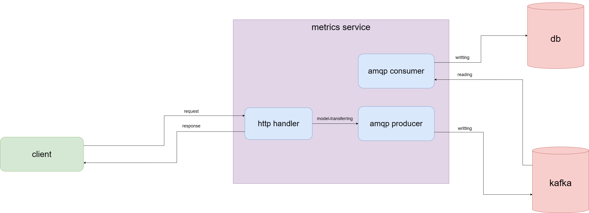

## [Тестовое задание](https://github.com/intersvyaz/test/blob/master/golang.md) - сервис для сбора телеметрии с мобильного приложения, для последующей аналитики.

### Сборка:
```
mv .env.example .env

cd deploy
docker-compose up
```
### or
```
mv .env.example .env

make docker
```

### Стэк сервиса:
- Golang (std http)
- PostgreSQL
- Kafka

### Точки роста:
1. Увеличение кол-ва партиций в бд (сейчас партицирование по дате (по числу) )
2. Шардирование бд по другому ключу, например layout_id
3. Сейчас используется паттерн sync-to-async (приходит запрос, пишем в очередь, даем ответ), можно также увеличить кол-во сервисов для обработки очереди и добавить балансировщик для записи в очередь (последнее сомнительно)

## API:

### POST /track
#### Отправка метрик
- Тело запроса
  - user_id (string)
  - event_id (int)
  - event_name (string)
  - layout_id (int)
  - created_date (datetime)

Запрос:
```
curl --location 'http://localhost:8081/track' \
--data '{
    "user_id": "user_id",
    "event_id": 1,
    "event_name": "event_name",
    "layout_id": 1,
    "created_date": "2012-05-31T18:25:43Z"
}'
```
Тело ответа (code 202):
```
{
"message": "metric was tracked"
}
```
Тело ответа (code 400):
```
{
"error": "incorrect body"
}
```

## Схема сервиса



## Схема базы данных

